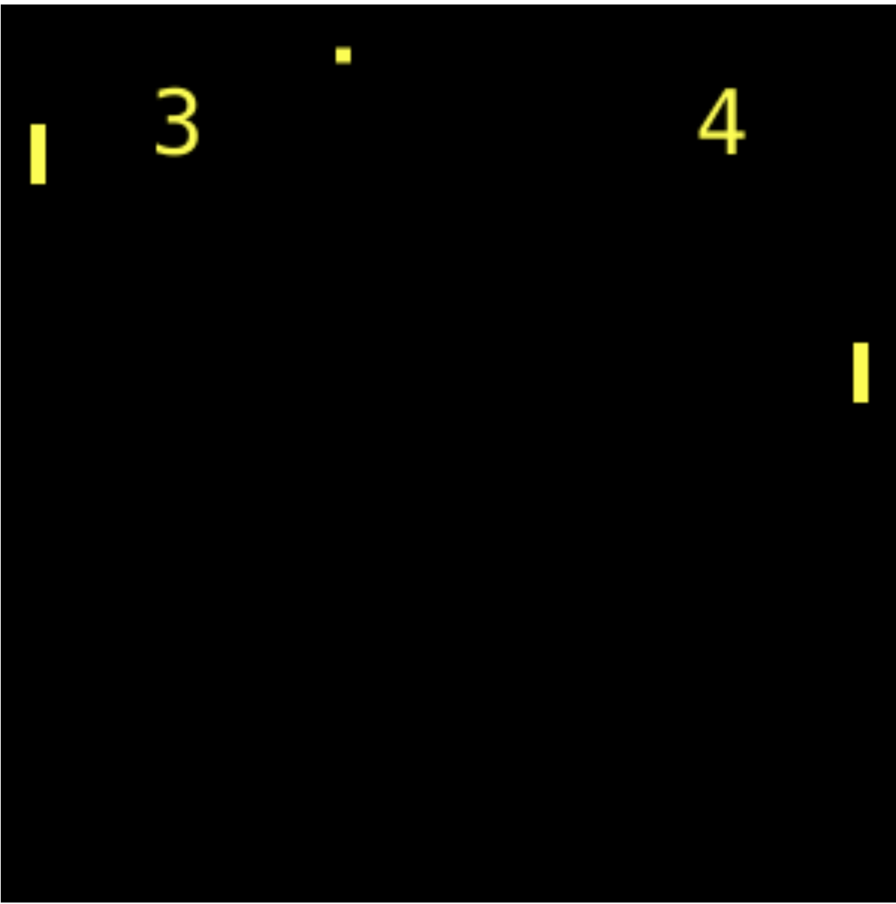
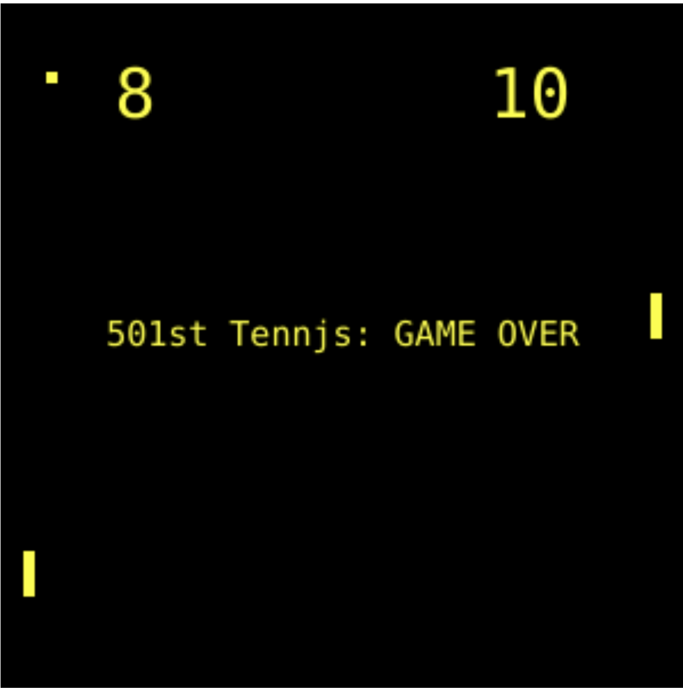

# Tennjs
A simple JavaScript version of the classic game "Pong" Using Canvas API

 
  

# 🎾 Tennjs 
Tennjs is a 2d game based on the classic game Pong. original idea influenced by the popular arcade game "Alien Invasion."
I created this game by following the "JavaScript Crash Course" book and the result is my attempt.  

## Introduction
> In Tennjs, the player controls uses their mouse/trackpad to move the paddle up and down and score against the CPU opponent.
> First to 10 points wins the game. 

## 🔧 Requeriments
- Any web browser.

## :video_game: Controls

- Mouse/Trackpad to control the paddle in a vertical motion. 

### Cloning the Repository

$ git clone https://github.com/numa-501st/Tennjs.git

## 🕹️ Let's play

 
  

